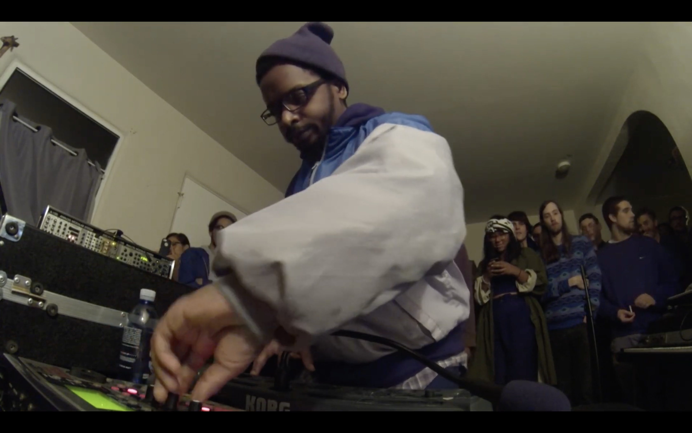
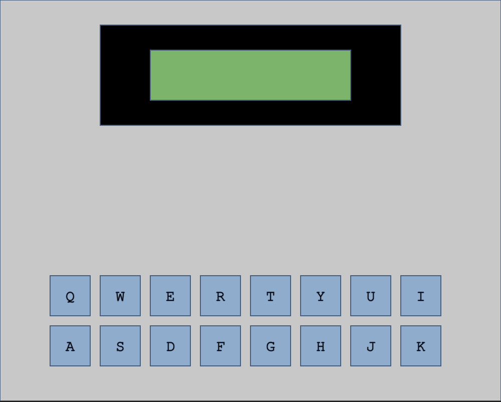
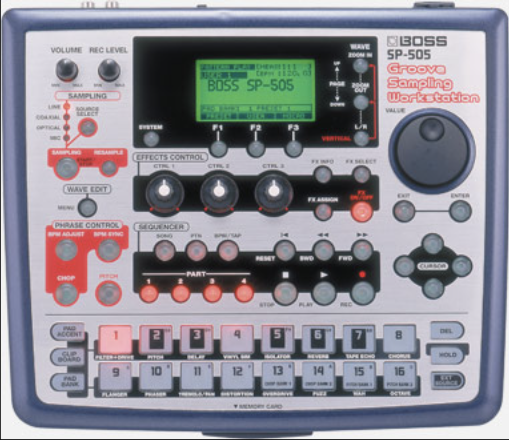

# READ ME

## "Delay Looping"



Pioneered by [Detroit producer Dakim](https://www.youtube.com/watch?v=AmQ7AMnooj0&t=578s), “Delay Looping” is a beat-making technique that uses a regular delay effect as a free-running looper.  By adjusting the delay parameters, you can shift the timing and character of the sound on the fly—perfect for improvising entire beats, soundscapes, or live performances.  

I've been utilizing this technique for a while and always wondered what a dedicated instrument for it would look like.  Essentially, all that's needed is a delay effect with adjustable parameters and sound sources that could be triggered in a rhythmic fashion.  By combining the p5.js library: [p5.sound](https://p5js.org/reference/p5.sound/#p5.sound) with the drawing capabilities of p5.js, I was able to create an interface for the looper that explains the parameters to new users and displays meaningful information about the system.


## Triggering Sounds 

I decided to work on the sound sources for the looper first, which will eventually comprise of 16 different audio files, each corresponding to a key on a computer keyboard.  When a specific key is pressed, its corresponding sample is played.  Sixteen samples work well because I can have eight on the top row (Q–O) corresponding to drum samples, and eight on the row below (A–L) corresponding to more melodic samples. I used this key-pressed function template from the [p5.js refrence](https://p5js.org/reference/p5/keyPressed/):


```function keyPressed() {
  if (key === 'c') {
    // Code to run.
  }
  if (keyCode === ENTER) {
    // Code to run.
  }
}
```

To use samples I sourced myself, I use the `preload` function, which loads a sound before `setup` so it can be played instantly.

```let kick;
function preload() {
  kick = loadSound("Sounds/K1.Kick.mp3");
}
```

I then combined the key-press function with the loaded sounds.

```let kick;
function preload() {
  kick = loadSound("Sounds/K1.Kick.mp3");
}
function setup() {
  createCanvas(200, 200);
  userStartAudio();
}
function keyPressed() {
  if (key === 'q') {
    kick.play();
  }
}
```

Every time the Q key is pressed on the keyboard, **Kick.mp3** will play.

This is the basis of triggering sounds using the looper, all that was needed were more sounds.

```let kick;
let clap;
let closedHat;
let openHat;
function preload() {
  kick = loadSound("Sounds/K1.Kick.mp3");
  clap = loadSound("Sounds/K1.Clap.mp3");
  closedHat = loadSound("Sounds/K1.CH.mp3");
  openHat = loadSound("Sounds/K1.OH.mp3");
}
function setup() {
  createCanvas(200, 200);
  userStartAudio();
}
function keyPressed() {
  if (key === 'q') {
    kick.play();
  }
  if (key === 'w') {
    clap.play();
  }
  if (key === 'e') {
    closedHat.play();
  }
  if (key === 'r') {
    openHat.play();
  }
}
```

With four sounds, I could now test whether the samples could be triggered in a rhythmic fashion (with as little latency as possible) together, which worked well.  Now that I had a basic four-sample triggering player, I could work on the delay looper.

## Delay Effect

```loopDelay = new p5.Delay();
loopDelay.process(source, delayTime, feedback, filterFrequency);
```

Here we can see the multiple parameters that [p5.Delay](https://p5js.org/reference/p5.sound/p5.Delay/) offers.  This is how it should be configured for Delay Looping:

- source - Sound input: what sound is being affected by the looper. 
	- (I originally thought only one sound could go through each instance of delay, but I later found out about buses/chaining, which reduced the number of delay instances.)
- delayTime - Sets the delay (echo) time, in seconds (0-1).
	- I wanted this parameter to be adjustable by the user while the delay is active.
	- Unfortunately, this looper is capped at 1 second (maybe there’s a way to make it longer?).
- feedback - Determines how much signal is sent each time through the loop.
	- For the looper to actually loop, the feedback must be set as close to 1 as possible (A feedback greater than 1.0 is not desirable because it will increase the overall output each time through the loop, creating an infinite feedback loop.
	- I wanted this parameter to be adjustable by the user while the delay is active, but in a slightly different way than the delayTime.
- filterFrequency - Sets a low-pass filter frequency for the delay.
	- I had slight trouble with this; I didn’t know there was a default filter value, and the delay was outputting noticeable filtered outputs.
	- I manually changed it to 2300, and it stays at that value the entire time.
 
I now want every sound to go through a delay thats configured like this, along with the variables that need to be changed while active:

```delayTime = 0.5;
feedback = 0.5;
loopDelay = new p5.Delay();
loopDelay.process(kick, delayTime, feedback, 20000);
loopDelay.process(clap, delayTime, feedback, 20000);
loopDelay.process(closedHat, delayTime, feedback, 20000);
loopDelay.process(openHat, delayTime, feedback, 20000);
```

For the variables, I added a slider to change the delayTime while it is active and set the feedback to 0.9 (a slider for this will be added later).

`timeSlider = createSlider(0, 1, 0.5, 0.01);`

added a function to draw stuff (the slider)

```function draw(){
  background(0);
delayTime = timeSlider.value();
loopDelay.delayTime(delayTime);
}
```

Once this was complete, I had the basis for the entire looper: multiple triggerable sound sources that I could play with minimal latency, and a delay effect whose parameters I could adjust while active.


## Finishing Touches To Looper

- Instead of sending each individual sound source into its own delay, I found that I could just use one by disconnecting each source from the "Master" and connecting it to a bus.  By doing this, I’m also able to chain that singular delay output to the input of another effect, like a compressor.  I added a compressor to act as a glue for each sound source and to provide protection against very loud feedback.

	- Having a single delay also decreased the number of audio nodes. Every sound instance that p5.sound creates generates a new AudioBufferSourceNode. These nodes currently aren’t being reused, and when too many samples are triggered this quickly, the browser ends up with a large number of delay nodes.
	
- I added a feedback slider assigned to a key press (Z) that sets the feedback to zero while pressed and back to 0.99 when released. (ERASER)
	- I later added a toggle key (X) so you could turn the delay looper capabilities off (good for just hearing the available sounds).
	- Feedback set to 0 is the same as turning the delay effect off.

## Display + Updated Key Triggering 

While working on the looper, I was also drawing what the interface was potentially going to look like and what kind of information I wanted to show in a separate p5.js project.
I based the interface off a BOSS SP-505, the same sampler used in the Dakim Boiler Room set.






I wanted to incorporate visual feedback when you pressed a key. To achieve this, I had to modify my original key-triggering code to work with the changes in the display. I utilized arrays and boolean states (true or false) to switch the colors of rectangles when the corresponding key is pressed.

``` let topKeys = ["Q", "W", "E", "R", "T", "Y", "U", "I"];
let bottomKeys = ["A", "S", "D", "F", "G", "H", "J", "K"];
let keyStates = {}; 
topKeys.concat(bottomKeys).forEach((k) => (keyStates[k] = false));```

Take all the keys from the top row and bottom row, loop through them, and create an entry in **keyStates** that starts as false (meaning the key is not being pressed).

In the `Draw` function:

```// Top row color keys
for (let i = 0; i < topKeys.length; i++) {
	fill(keyStates[topKeys[i]] ? color(216, 110, 112) : color(135, 173, 208));
	rect(50 + i * 50, 250, 40, 40);
	fill(0);
	text(topKeys[i], 70 + i * 50, 275);
}
```

This loops through every key in the topKeys array.

`topKeys = ["Q", "W", "E", "R", "T", "Y", "U", "I"];`

keyStates[topKeys[i]] is either true or false

- If true (Key IS pressed): color(216, 110, 112) (Red)
- If false( Key NOT pressed): color((135, 173, 208 (Blue) 

The rest adds the squares per each key, where they are located on the canvas, and the text (Q, W, E, R, T, Y, U, I)


Repeat for bottom keys:

```// Bottom row color keys
for (let i = 0; i < bottomKeys.length; i++) {
	fill(keyStates[bottomKeys[i]] ? color(216, 110, 112) : color(135, 173, 208));
    rect(50 + i * 50, 310, 40, 40);
    fill(0);
    text(bottomKeys[i], 70 + i * 50, 335);
}
```

Update the loop delay so feedback sliders work with Z and X (true or false)

```// Loop delay updated
  loopDelay.delayTime(timeSlider.value());
  let targetFeedback = holdingZ || toggleX ? 0 : feedbackSlider.value();
  loopDelay.feedback(targetFeedback);
```

For the `keyPressed` function:


```let k = key.toUpperCase();
  if (keyStates[k] !== undefined) keyStates[k] = true;
  ```

Variable K stores what key is being pressed while setting it to upper case.  If the pressed key exists in keyStates, you set it to true. This allows the rectangles on screen to light up when pressed:


Variable K is also used to store the key that plays each corresponding sample:

```
  if (k === "Q") kick.play();
  if (k === "W") clap.play();
  if (k === "E") closedHat.play();
  ...
```

The feedback slider keys are also given their function.

  ```if (k === "Z") holdingZ = true;
  if (k === "X") toggleX = !toggleX;
  ```
  
and Z has a `keyReleased` function, checks if the key is not in use:

```function keyReleased() {
  let k = key.toUpperCase();
  if (keyStates[k] !== undefined) keyStates[k] = false;
  if (k === "Z") holdingZ = false;
}
```


### Spectrum Analyzer 

[The Coding Train - 17.11: Sound Visualization: Frequency Analysis with FFT - p5.js Sound Tutorial](https://www.youtube.com/watch?v=2O3nm0Nvbi4&list=PLRqwX-V7Uu6aFcVjlDAkkGIixw70s7jpW&index=11)

Created the Looper's Spectrum Analyzer by following along with this video. Utilizes FFT (Fast Fourier Transform), which takes the audio signal and converts it into a frequency representation.

I also used [The Coding Train's](https://www.youtube.com/@TheCodingTrain) videos to get introduced to and familiar with p5.sound.

`fft = new p5.FFT(0.8, 32);`

This creates a new fft object: 0.8 represents the smoothing amount, and 32 represents the number of bands.


## Conclusion
Added finishing touches to the display, such as an indicator for when the Eraser is engaged.

``` fill(targetFeedback === 0 ? "red" : "white");
stroke(0);
circle(width - 150, 210, 20);
  ```


Along with extra aesthetic text and shapes added to the display, as well as explanatory text to guide new users, the looper now provides both functionality and clarity. One slight issue remains: when pressing multiple keys simultaneously, the display sometimes stays in the switched color.

Overall, I really like the simple interface—it emphasizes how much you can do with so little. In the future, I may want to allow users to easily change sound sources, such as providing different sound banks to choose from, as well as the ability for users to add their own samples.


